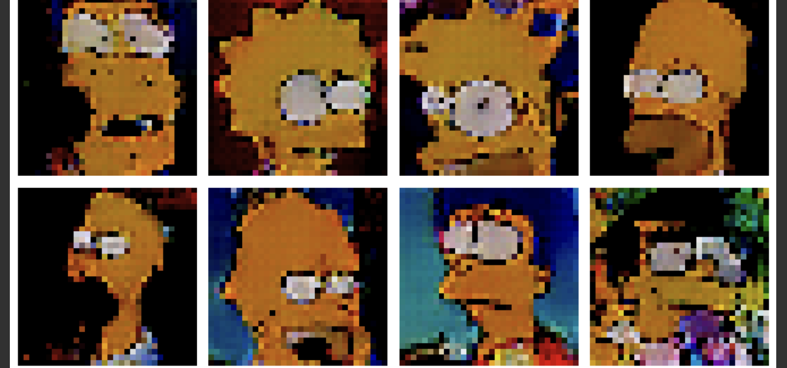

## Simpson Face Generator

This project is a Simpson face generator that uses a generative model to generate new Simpson faces based on existing images. The code provided includes a dataloader, a generative model class, a loss function, and a training loop.

### Requirements

To run this project, you need to have the following dependencies installed:

- Python 3.x
- PyTorch
- Matplotlib
- NumPy
- OpenCV
- tqdm
- imageio

### Getting Started

1. Clone the repository from GitHub: [repository link]
2. Install the required dependencies listed above.
3. Download the SimpsonFaces.zip dataset from the following link: [SimpsonFaces.zip ↗](https://www.dropbox.com/s/g0w7a3x1aw3oonf/SimpsonFaces.zip?dl=0).
4. Unzip the downloaded file and place the contents in a folder named "cropped/" in the project directory.

### Usage

The main code for the Simpson face generator is provided in the Jupyter Notebook file named "Simpson_Face_Generator.ipynb". You can run the notebook and follow the instructions to train the generative model and generate Simpson faces.

The notebook contains the following sections:

1. Data Loading: The dataloader reads the images from the "cropped/" folder and prepares them for training.
2. Visualizing the Data: The notebook visualizes a batch of images from the dataset to give you an idea of the input data.
3. Generative Model: The generative model class is defined, which includes the architecture of the generator and discriminator networks.
4. Training Loop: The training loop trains the generative model using a combination of real and fake images and updates the network weights.
5. Loss Visualization: The notebook plots the generator and discriminator loss during training to monitor the progress.
6. Generate and Plot Data: Finally, the notebook generates a batch of 64 images using the trained generator and plots them in subplots of 8 rows and 8 columns.

### Results

After running the training loop, the generative model will learn to generate new Simpson faces based on the input dataset. You can experiment with different hyperparameters, network architectures, and training settings to improve the quality of the generated faces.

The generated images will be saved in the project directory, and you can visualize them using the provided code in the notebook.

Here is a sample result after a few epochs:

### License

This project is licensed under the [MIT License](LICENSE).

### Acknowledgements

- The dataset used in this project is sourced from [Simpson Faces Dataset ↗](https://www.dropbox.com/s/g0w7a3x1aw3oonf/SimpsonFaces.zip?dl=0).
- The generative model architecture and training loop are inspired by the concept of Generative Adversarial Networks (GANs).
